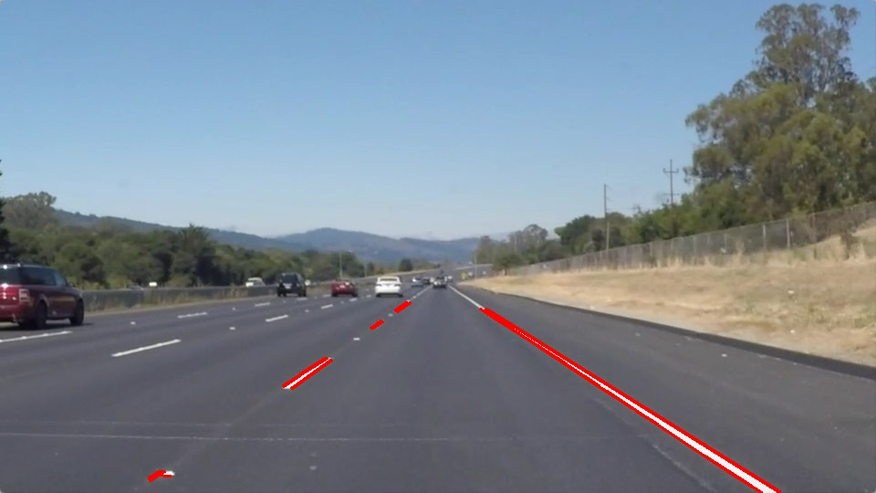
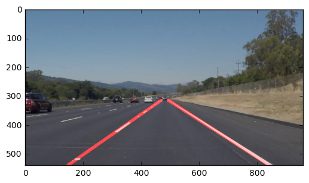

# **Finding Lane Lines on the Road** 
***
This projects goal is to find lanes in an image using computer visiong algorithms. In this project, you will use the tools you learned about in the lesson to identify lane lines on the road.  You can develop your pipeline on a series of individual images, and later apply the result to a video stream (really just a series of images). Check out the video clip "raw-lines-example.mp4" (also contained in this repository) to see what the output should look like after using the helper functions below. 

Once you have a result that looks roughly like "raw-lines-example.mp4", you'll need to get creative and try to average and/or extrapolate the line segments you've detected to map out the full extent of the lane lines.  You can see an example of the result you're going for in the video "P1_example.mp4".  Ultimately, you would like to draw just one line for the left side of the lane, and one for the right.

---
Let's have a look at our first image called 'test_images/solidWhiteRight.jpg'.  Run the 2 cells below (hit Shift-Enter or the "play" button above) to display the image.

**Note** If, at any point, you encounter frozen display windows or other confounding issues, you can always start again with a clean slate by going to the "Kernel" menu above and selecting "Restart & Clear Output".

---

**The tools you have are color selection, region of interest selection, grayscaling, Gaussian smoothing, Canny Edge Detection and Hough Tranform line detection.  You  are also free to explore and try other techniques that were not presented in the lesson.  Your goal is piece together a pipeline to detect the line segments in the image, then average/extrapolate them and draw them onto the image for display (as below).  Once you have a working pipeline, try it out on the video stream below.**

---

<figure>
 
 <figcaption>
 <p></p> 
 <p style="text-align: center;"> Your output should look something like this (above) after detecting line segments using the helper functions below </p> 
 </figcaption>
</figure>
 <p></p> 
<figure>
 
 <figcaption>
 <p></p> 
 <p style="text-align: center;"> Your goal is to connect/average/extrapolate line segments to get output like this</p> 
 </figcaption>
</figure>


```python
#importing some useful packages
import matplotlib.pyplot as plt
import matplotlib.image as mpimg
import numpy as np
import cv2
%matplotlib inline
```


```python
#reading in an image (Uncomment the according line below for to alter the test image. All 6 testimages are selectable)
image = mpimg.imread('test_images/solidWhiteRight.jpg')
#image = mpimg.imread('test_images/solidWhiteCurve.jpg')
#image = mpimg.imread('test_images/solidYellowCurve.jpg')
#image = mpimg.imread('test_images/solidYellowCurve2.jpg')
#image = mpimg.imread('test_images/solidYellowLeft.jpg')
#image = mpimg.imread('test_images/whiteCarLaneSwitch.jpg')
#printing out some stats and plotting
print('This image is:', type(image), 'with dimesions:', image.shape)
plt.imshow(image)  #call as plt.imshow(gray, cmap='gray') to show a grayscaled image
```

    This image is: <class 'numpy.ndarray'> with dimesions: (540, 960, 3)
    


    <matplotlib.image.AxesImage at 0x8100f60>


**Some OpenCV functions (beyond those introduced in the lesson) that might be useful for this project are:**

`cv2.inRange()` for color selection  
`cv2.fillPoly()` for regions selection  
`cv2.line()` to draw lines on an image given endpoints  
`cv2.addWeighted()` to coadd / overlay two images
`cv2.cvtColor()` to grayscale or change color
`cv2.imwrite()` to output images to file  
`cv2.bitwise_and()` to apply a mask to an image

**Check out the OpenCV documentation to learn about these and discover even more awesome functionality!**

Below are some helper functions to help get you started. They should look familiar from the lesson!


```python
import math

def grayscale(img):
    """Applies the Grayscale transform
    This will return an image with only one color channel
    but NOTE: to see the returned image as grayscale
    you should call plt.imshow(gray, cmap='gray')"""
    return cv2.cvtColor(img, cv2.COLOR_BGR2GRAY)
    
def canny(img, low_threshold, high_threshold):
    """Applies the Canny transform"""
    return cv2.Canny(img, low_threshold, high_threshold)

def gaussian_blur(img, kernel_size):
    """Applies a Gaussian Noise kernel"""
    return cv2.GaussianBlur(img, (kernel_size, kernel_size), 0)

def region_of_interest(img, vertices):
    """
    Applies an image mask.
    
    Only keeps the region of the image defined by the polygon
    formed from `vertices`. The rest of the image is set to black.
    """
    #defining a blank mask to start with
    mask = np.zeros_like(img)   
    
    #defining a 3 channel or 1 channel color to fill the mask with depending on the input image
    if len(img.shape) > 2:
        channel_count = img.shape[2]  # i.e. 3 or 4 depending on your image
        ignore_mask_color = (255,) * channel_count
    else:
        ignore_mask_color = 255
        
    #filling pixels inside the polygon defined by "vertices" with the fill color    
    cv2.fillPoly(mask, vertices, ignore_mask_color)
    
    #returning the image only where mask pixels are nonzero
    masked_image = cv2.bitwise_and(img, mask)
    return masked_image


def draw_lines(img, lines, color=[255, 0, 0], thickness=10):
    """
    NOTE: this is the function you might want to use as a starting point once you want to 
    average/extrapolate the line segments you detect to map out the full
    extent of the lane (going from the result shown in raw-lines-example.mp4
    to that shown in P1_example.mp4).  
    
    Think about things like separating line segments by their 
    slope ((y2-y1)/(x2-x1)) to decide which segments are part of the left
    line vs. the right line.  Then, you can average the position of each of 
    the lines and extrapolate to the top and bottom of the lane.
    
    This function draws `lines` with `color` and `thickness`.    
    Lines are drawn on the image inplace (mutates the image).
    If you want to make the lines semi-transparent, think about combining
    this function with the weighted_img() function below
    """
    
    #--------------------Average the lines
    
    'Create an array which will hold in its columns which class the line is in, their slope, their x coordinate at the bottom of the picture'
    slopes = np.zeros(shape=(len(lines),3))
    'Ceate counting variables, count=number of lines, count_left=number of left lane lines ....'
    count=0;
    count_left=0;
    count_right=0;
    'Ceate an array which will hold the final lines. Note the y coordinates are the bottom of the picture and the top of the masked region'
    'Starting point for the x coordinates is 0 but these are subject to get calculated below'
    Averaged_Lines=np.array([[[0, 540, 0, 315]], [[0, 315, 0, 540]]])
    for line in lines:
        for x1,y1,x2,y2 in line:
            'Have slope calculated and saved'
            alpha=(y2-y1)/(x2-x1)
            slopes[count][1]=alpha
            'Slope must be either between -15° till -75° to be a left or 15° till 75° to be a right lane'
            if 0.27 <= alpha <= 3.7:
                'save class of lane 2=right, 1=left, 0=no lane line, 0 will be ignored'
                slopes[count][0]=2
                'Calculate the x coordinate on the bottom of the picture and top of the masked region'
                'Sum up the x coordinate for each of the lanes. Will average this later see below'
                slopes[count][2]=x1+((540-y1)/alpha)
                Averaged_Lines[1][0][2]=Averaged_Lines[1][0][2]+slopes[count][2]
                Averaged_Lines[1][0][0]=Averaged_Lines[1][0][0]+((315-540)/alpha)
                count_right=count_right+1
            elif -3.7 <= alpha <= -0.27:
                'save class of lane 2=right, 1=left, 0=no lane line, 0 will be ignored'
                slopes[count][0]=1
                'Calculate the x coordinate on the bottom of the picture and top of the masked region'
                'Sum up the x coordinate for each of the lanes. Will average this later see below'
                slopes[count][2]=x1+((540-y1)/alpha)
                Averaged_Lines[0][0][0]=Averaged_Lines[0][0][0]+slopes[count][2]
                Averaged_Lines[0][0][2]=Averaged_Lines[0][0][2]+((315-540)/alpha)
                count_left=count_left+1
            count=count+1;
    'Average the x coordinates by dividing with the count variables'
    if count_right>0:
        Averaged_Lines[1][0][2]=Averaged_Lines[1][0][2]/count_right
        Averaged_Lines[1][0][0]=Averaged_Lines[1][0][2]+Averaged_Lines[1][0][0]/count_right
    if count_left>0:
        Averaged_Lines[0][0][0]=Averaged_Lines[0][0][0]/count_left
        Averaged_Lines[0][0][2]=Averaged_Lines[0][0][0]+Averaged_Lines[0][0][2]/count_left   
    
    #--------------------Draw the lines
    
    'Draw the averages lines'
    for line in Averaged_Lines:
        for x1,y1,x2,y2 in line:
            cv2.line(img, (x1, y1), (x2, y2), color, thickness)

def hough_lines(img, rho, theta, threshold, min_line_len, max_line_gap):
    """
    `img` should be the output of a Canny transform.
        
    Returns an image with hough lines drawn.
    """
    lines = cv2.HoughLinesP(img, rho, theta, threshold, np.array([]), minLineLength=min_line_len, maxLineGap=max_line_gap)
    line_img = np.zeros((*img.shape, 3), dtype=np.uint8)
    draw_lines(line_img, lines)
    return line_img

# Python 3 has support for cool math symbols.

def weighted_img(img, initial_img, α=0.8, β=1., λ=0.):
    """
    `img` is the output of the hough_lines(), An image with lines drawn on it.
    Should be a blank image (all black) with lines drawn on it.
    
    `initial_img` should be the image before any processing.
    
    The result image is computed as follows:
    
    initial_img * α + img * β + λ
    NOTE: initial_img and img must be the same shape!
    """
    return cv2.addWeighted(initial_img, α, img, β, λ)
```

## Test on Images

Now you should build your pipeline to work on the images in the directory "test_images"  
**You should make sure your pipeline works well on these images before you try the videos.**


```python
import os
os.listdir("test_images/")
'First convert to grayscale and then blur with a gaussian filter in order to make canny edge detection work better'
gray=grayscale(image)
blurgray=gaussian_blur(gray, 5)
'Perform canny edge detection'
edge=canny(blurgray, 50, 150)
'Create a mask region with 4 vertices'
imshape = image.shape
vertices = np.array([[(0,imshape[0]),(490, 315), (510, 315), (imshape[1],imshape[0])]], dtype=np.int32)
masked_edges=region_of_interest(edge, vertices)
'Perform the hough line detection and receive an image with the drawn lines. Note these lines are' 
'already averaged because the draw lines function is also averaging them before drawing'
linesimage=hough_lines(masked_edges, 2, np.pi/180, 70, 15, 20)
'Overlay the lines with the original image and show that image'
finalimage =weighted_img(linesimage,image)
plt.imshow(finalimage)
```


    <matplotlib.image.AxesImage at 0x88fea90>





run your solution on all test_images and make copies into the test_images directory).

## Test on Videos

You know what's cooler than drawing lanes over images? Drawing lanes over video!

We can test our solution on two provided videos:

`solidWhiteRight.mp4`

`solidYellowLeft.mp4`


```python
# Import everything needed to edit/save/watch video clips
from moviepy.editor import VideoFileClip
from IPython.display import HTML
```


```python
def process_image(image):
    # NOTE: The output you return should be a color image (3 channel) for processing video below
    # TODO: put your pipeline here,
    # you should return the final output (image with lines are drawn on lanes)
    
    'First convert to grayscale and then blur with a gaussian filter in order to make canny edge detection work better'
    gray=grayscale(image)
    blurgray=gaussian_blur(gray, 5)
    'Perform canny edge detection'
    edge=canny(blurgray, 50, 150)
    'Create a mask region with 4 vertices'
    imshape = image.shape
    vertices = np.array([[(0,imshape[0]),(490, 315), (510, 315), (imshape[1],imshape[0])]], dtype=np.int32)
    masked_edges=region_of_interest(edge, vertices)
    'Perform the hough line detection and receive an image with the drawn lines. Note these lines are' 
    'already averaged because the draw lines function is also averaging them before drawing'
    linesimage=hough_lines(masked_edges, 2, np.pi/180, 70, 15, 20)
    'Overlay the lines with the original image and return that image'
    finalimage =weighted_img(linesimage,image)

    return finalimage
```

Let's try the one with the solid white lane on the right first ...


```python
white_output = 'white.mp4'
clip1 = VideoFileClip("solidWhiteRight.mp4")
white_clip = clip1.fl_image(process_image) #NOTE: this function expects color images!!
%time white_clip.write_videofile(white_output, audio=False)
```

    [MoviePy] >>>> Building video white.mp4
    [MoviePy] Writing video white.mp4
    

    100%|███████████████████████████████████████▊| 221/222 [00:07<00:00, 31.20it/s]
    

    [MoviePy] Done.
    [MoviePy] >>>> Video ready: white.mp4 
    
    Wall time: 8.43 s
    

Play the video inline, or if you prefer find the video in your filesystem (should be in the same directory) and play it in your video player of choice.


```python
HTML("""
<video width="960" height="540" controls>
  <source src="{0}">
</video>
""".format(white_output))
```


<video width="960" height="540" controls>
  <source src="white.mp4">
</video>


**At this point, if you were successful you probably have the Hough line segments drawn onto the road, but what about identifying the full extent of the lane and marking it clearly as in the example video (P1_example.mp4)?  Think about defining a line to run the full length of the visible lane based on the line segments you identified with the Hough Transform.  Modify your draw_lines function accordingly and try re-running your pipeline.**

Now for the one with the solid yellow lane on the left. This one's more tricky!


```python
yellow_output = 'yellow.mp4'
clip2 = VideoFileClip('solidYellowLeft.mp4')
yellow_clip = clip2.fl_image(process_image)
%time yellow_clip.write_videofile(yellow_output, audio=False)
```

    [MoviePy] >>>> Building video yellow.mp4
    [MoviePy] Writing video yellow.mp4
    

    100%|███████████████████████████████████████▉| 681/682 [00:24<00:00, 28.27it/s]
    

    [MoviePy] Done.
    [MoviePy] >>>> Video ready: yellow.mp4 
    
    Wall time: 25.4 s
    


```python
HTML("""
<video width="960" height="540" controls>
  <source src="{0}">
</video>
""".format(yellow_output))
```


    ---------------------------------------------------------------------------

    NameError                                 Traceback (most recent call last)

    <ipython-input-1-05ea049adcc3> in <module>()
    ----> 1 HTML("""
          2 <video width="960" height="540" controls>
          3   <source src="{0}">
          4 </video>
          5 """.format(yellow_output))
    

    NameError: name 'HTML' is not defined


## Reflections

Congratulations on finding the lane lines!  As the final step in this project, we would like you to share your thoughts on your lane finding pipeline... specifically, how could you imagine making your algorithm better / more robust?  Where will your current algorithm be likely to fail?

Please add your thoughts below,  and if you're up for making your pipeline more robust, be sure to scroll down and check out the optional challenge video below!


## Submission

If you're satisfied with your video outputs it's time to submit!  Submit this ipython notebook for review.

# Review Section

Generally I think these are challenges to the current approach:

-It has not been tested with different lighting scenarios. There can be direct sunlight, fog, rain etc. In order to at least find out additional scenes would needed to be tested. Additional image processing before the pipeline might be necessary.

-It has not been tested with different road scenarios. It is not clear that all roads have similar lane markings. There could be color differences etc.

-The mask region has been specifically designed to be perfect for the videos and images. However that does not have be a good mask region for all sorts of scenarios. I suspect it will cause a problem in case a lane change is being performed. For example the masked region being selected now could cause that one side of the lane one is on is completely masked out. It could be beneficial to adjust the masked region dynamically based on egomotion.

-The post processing of line assumes that all lines that are within 15° - 75° are a lane border line. This is true in case the mask region is fine. In case the masked region is not perfect it could lead to lines that are not at all on the lane. Additionally filtering based on the behavior of lines could be beneficial. E.g Horizon lines will be at roughly the same spot in every video frame.


## Optional Challenge

Try your lane finding pipeline on the video below.  Does it still work?  Can you figure out a way to make it more robust?  If you're up for the challenge, modify your pipeline so it works with this video and submit it along with the rest of your project!


```python
challenge_output = 'extra.mp4'
clip2 = VideoFileClip('challenge.mp4')
challenge_clip = clip2.fl_image(process_image)
%time challenge_clip.write_videofile(challenge_output, audio=False)
```


```python
HTML("""
<video width="960" height="540" controls>
  <source src="{0}">
</video>
""".format(challenge_output))
```
